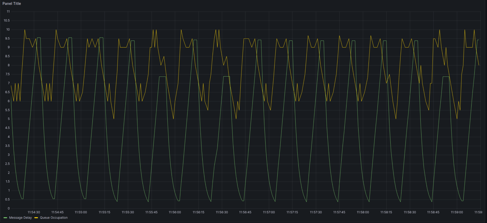

## Producer-Consumer Dynamic Rate Adjustment System
### University of Padova - A.A. 2023-24

---

## Objective

- To develop a system that allows dynamic adjustment of message production rate based on the consumer's processing capability.
- To implement a monitoring actor that controls the message flow to prevent overproduction or underproduction.
- To ensure the system maintains a balanced load, optimizing resource utilization and maintaining system stability.

---

## Project Description
This project implements a producer-consumer model where the producer generates messages at a variable rate, and the consumer processes these messages at a consistent rate. A separate monitoring component oversees the queue length to adjust the production rate dynamically based on a defined threshold. This mechanism aims to maintain efficient message processing without overloading the consumer or idling the producer.

---

#### Phase 1: Requirements Analysis
- **Functional Requirements:**
    - The system should be able to produce and consume messages.
    - A separate monitoring actor must adjust the message production rate.
    - The consumer should process messages with a given delay to simulate real-world usage.

- **Non-Functional Requirements:**
    - **Performance:** The system must perform efficiently under varying load conditions.
    - **Scalability:** It should accommodate changes in production and consumption rates without significant modifications.
    - **Reliability:** The system should handle errors gracefully without crashing.

---

## Organization of the Repository

The overall structure of the repository is as follows:

---

## Diagram

---

## System Requirements
- **Hardware Requirements:**
    - A computing environment capable of running concurrent processes or threads.

- **Software Requirements:**
    - An operating system that supports multitasking (e.g., Linux, Windows, macOS).
    - A programming environment that supports concurrency (e.g., Python with asyncio, Java with ExecutorService).
    - Necessary libraries for queue management and threading/multiprocessing.

## Output of the Project

The output of the project will be a functional producer-consumer system where:
- The producer's rate of message generation is adjusted dynamically by the monitor actor based on the queue’s length.
- The consumer consistently processes messages at a pre-set delay.
- The system maintains an optimal queue length, ensuring that the consumer operates efficiently without being overburdened, and the producer does not remain idle for too long or overwhelm the syst

---

*Concurrent and Real Time Programming* is a course of the

* [Master Degree in Computer Engineering](https://degrees.dei.unipd.it/master-degrees/computer-engineering/) of the [Department of Information Engineering](https://www.dei.unipd.it/en/), [University of Padua](https://www.unipd.it/en/), Italy.

---

## License

All the contents of this repository are shared using the [GNU GENERAL PUBLIC LICENSE - VER. 3](https://www.gnu.org/licenses/gpl-3.0.html)

Write README.md for this project, contains the following sections:
1- Project description: a brief description of the project
2- Objectives: the objectives of the project
3- Requirement analysis
4- System hardware and software
6- Output of the project

Producer-(single) consumer program with dynamic message rate adjustment. The consumer shall consume messages at a given rate, that is, with a given delay simulating the consumed message usage. An actor (task or process) separate from producer and consumer shall periodically check the message queue length and if the length is below a given threshold, it will increase the production rate. Otherwise (i.e. the message length is above the given threshold), it will decrease the production rate.

