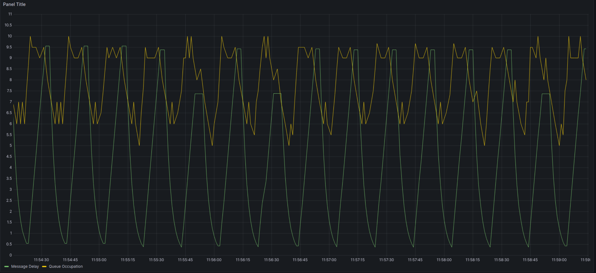

<a name="readme-top"></a>

[![Contributors][contributors-shield]][contributors-url]
[![Forks][forks-shield]][forks-url]
[![Stargazers][stars-shield]][stars-url]
[![Issues][issues-shield]][issues-url]
[![MIT License][license-shield]][license-url]
[![LinkedIn][linkedin-shield]][linkedin-url]

## Producer-Consumer Dynamic Rate Adjustment System
### University of Padova - A.A. 2023-24


<!-- PROJECT LOGO -->
<br />
<div align="center">
  <a href="https://github.com/farzad-845/CRTP">
    
  </a>
</div>

---

## Objective

- To develop a system that allows dynamic adjustment of message production rate based on the consumer's processing capability.
- To implement a monitoring actor that controls the message flow to prevent overproduction or underproduction.
- To ensure the system maintains a balanced load, optimizing resource utilization and maintaining system stability.

---

## Project Description
This project implements a producer-consumer model where the producer generates messages at a variable rate, and the consumer processes these messages at a consistent rate. A separate monitoring component oversees the queue length to adjust the production rate dynamically based on a defined threshold. This mechanism aims to maintain efficient message processing without overloading the consumer or idling the producer.

---

#### Phase 1: Requirements Analysis
- **Functional Requirements:**
    - The system should be able to produce and consume messages.
    - A separate monitoring actor must adjust the message production rate.
    - The consumer should process messages with a given delay to simulate real-world usage.

- **Non-Functional Requirements:**
    - **Performance:** The system must perform efficiently under varying load conditions.
    - **Scalability:** It should accommodate changes in production and consumption rates without significant modifications.
    - **Reliability:** The system should handle errors gracefully without crashing.


---

## Organization of the Repository

The overall structure of the repository is as follows:

---

## System Requirements
- **Hardware Requirements:**
    - A computing environment capable of running concurrent processes or threads.

- **Software Requirements:**
    - An operating system that supports multitasking (e.g., Linux, Windows, macOS).
    - A programming environment that supports concurrency (e.g., Python with asyncio, Java with ExecutorService).
    - Necessary libraries for queue management and threading/multiprocessing.
    - Redis server for analyzing the queue length and production rate.
---
##  Building the Project
For running the project you can make the application using the following command:

```bash
gcc main.c -Wall -Werror -o crtp -lhiredis
```
or simply use the makefile:

```bash
make all
```
---

## Output of the Project

The output of the project will be a functional producer-consumer system where:
- The producer's rate of message generation is adjusted dynamically by the monitor actor based on the queue’s length.
- The consumer consistently processes messages at a pre-set delay.
- The system maintains an optimal queue length, ensuring that the consumer operates efficiently without being overburdened, and the producer does not remain idle for too long or overwhelm the syst


### Diagram | Message Queue & Delay Analysis


---

*Concurrent and Real Time Programming* is a course of the

* [Master Degree in Computer Engineering](https://degrees.dei.unipd.it/master-degrees/computer-engineering/) of the [Department of Information Engineering](https://www.dei.unipd.it/en/), [University of Padua](https://www.unipd.it/en/), Italy.

---

## License

All the contents of this repository are shared using the [GNU GENERAL PUBLIC LICENSE - VER. 3](https://www.gnu.org/licenses/gpl-3.0.html)

[contributors-shield]: https://img.shields.io/github/contributors/farzad-845/CRTP.svg?style=for-the-badge
[contributors-url]: https://github.com/farzad-845/CRTP/graphs/contributors
[forks-shield]: https://img.shields.io/github/forks/farzad-845/CRTP.svg?style=for-the-badge
[forks-url]: https://github.com/farzad-845/CRTP/network/members
[stars-shield]: https://img.shields.io/github/stars/farzad-845/CRTP.svg?style=for-the-badge
[stars-url]: https://github.com/farzad-845/CRTP/stargazers
[issues-shield]: https://img.shields.io/github/issues/farzad-845/CRTP.svg?style=for-the-badge
[issues-url]: https://github.com/farzad-845/CRTP/issues
[license-shield]: https://img.shields.io/github/license/farzad-845/CRTP.svg?style=for-the-badge
[license-url]: https://github.com/farzad-845/CRTP/blob/master/LICENSE.txt
[linkedin-shield]: https://img.shields.io/badge/-LinkedIn-black.svg?style=for-the-badge&logo=linkedin&colorB=555
[linkedin-url]: https://linkedin.com/in/farzad-shami
